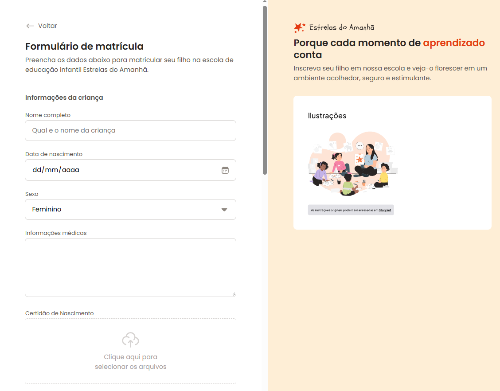
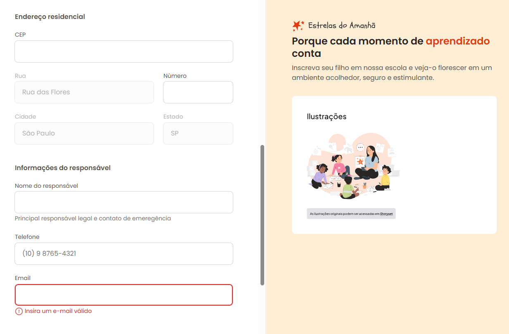
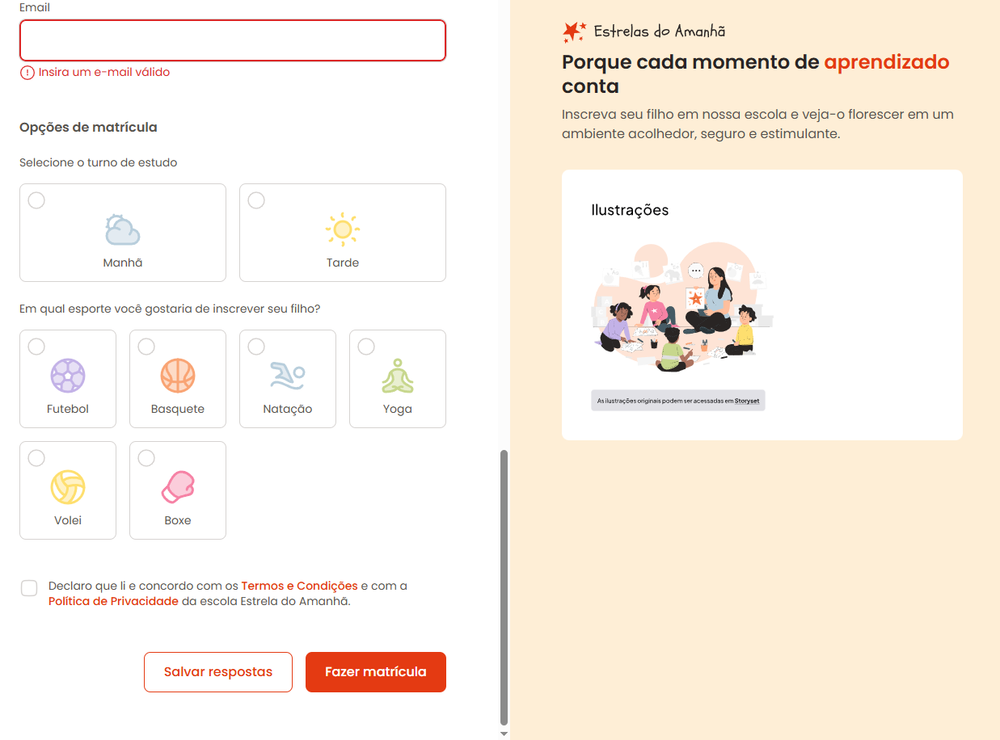

<h1 align="center" style="font-weight: bold;">Escola do Amanhã - Matricula💻</h1>

 <a href="#tech">Technologies</a> • 
 <a href="#started">Getting Started</a> • 

    <b>
      Enrollment form for the school of stars of tomorrow, 
      where the responsible person enters his data, chooses the shift and which sport the student will participate in.
    </b>
     
    <b> 
      Display grid, flex, inputs of various types, validations and much more were used.
    </b>

     <a href="https://thalesfortes.github.io/Formulario-De-Matricula/">📱 Visit this Project</a>

<h2 id="layout">🎨 Layout</h2>

      
      
      

<h2 id="tech">💻 Technologies</h2>

- HTML5
- CSS3

<h2 id="started">🚀 Getting started</h2>

- Just download the project with its assets and run it with liveserve or just by opening the html document

